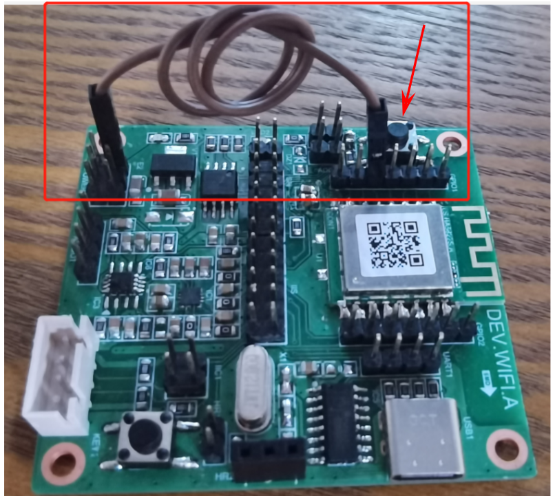

# DEV.WIFI.A

## 介绍

朗国DEV.WIFI.A开发板(以下称开发板)作为一款基于OpenHarmonyOS而设计的IOT开发板，集成了高性能的WIFI-BLE双模芯片ASR5822、外部存储芯片、语音播放芯片以及模数转换等，同时支持SPI等IOT设备常用外设接口，可外扩OLED显示屏、红外遥控等。

开发板外观如下图所示：

## 开发板规格

| 器件类别     | 开发板                                                              |
| -------------- | --------------------------------------------------------------------- |
| CPU          | 型号：ASR5822 ; 主频：最高 160MHz ; Flash：4MB/2MB RAM：352KB;       |
| Wifi特性     | 支持 802.11b/g/n 无线标准 ; 支持内置PCB 天线 ; 支持 STA/AP 工作模式; |
| BLE特性      | 支持BLE 配网。                                                        |
| 外部存储     | W25Q64 : 64M Bit IIC接口存储芯片。                                    |
| 语音播放     | IIS音频解码IC(ES7148) + 功放IC(NS4150) + 2.54mm排针接口。             |
| 模拟信号输入 | 预留一个ADC接口 (2.54mm排针)。                                        |
| 红外接收器   | 预留VS1838B 红外解码器接口 (2.54mm排座)。                             |
| OLED         | 预留一个4脚IIC OLED屏接口 (2.54mm排座)。                              |
| LED          | 板载一个电源指示灯：LED1 ；和一个可编程led灯：LED3。                  |
| GPIO        | 13个GPIO 通过排针引出 与其它外设复用，可通过跳帽选择。              |
| 按键         | 1个复位按键；1个可编程按键。                                          |
| USB转串口    | 板载ch340串口芯片。                                                   |
| 电源输入     | USB-C ; 输入电压5V ；工作电压3.3V；                                   |

## OpenHarmonyOS关键特性

| 组件名       | 能力介绍                                                                                       |
| -------------- | ------------------------------------------------------------------------------------------------ |
| 内核         | LiteOS-M                                                                                        |
| 上电启动     | 上电启动OpenHarmonyOS                                                                          |
| WLAN服务     | 提供WLAN服务能力。包括：station和hotspot模式的连接、断开、状态查询等。                           |
| BLE服务      | 提供BLE服务能力。包括：开启/关闭广播、发送/接收数据等。                                          |
| 外设控制     | 提供操作外设的能力。包括：I2C、I2S、ADC、UART、SPI、GPIO、PWM、FLASH等。                       |
| 基础加解密   | 提供密钥管理、加解密等能力。                                                                   |
| 系统服务管理 | 系统服务管理基于面向服务的架构，提供了OpenHarmonyOS统一化的系统服务开发框架。                  |
| 启动引导     | 提供系统服务的启动入口标识。在系统服务管理启动时，调用boostrap标识的入口函数，并启动系统服务。 |
| 系统属性     | 提供获取与设置系统属性的能力。                                                                   |
| 基础库       | 提供公共基础库能力。包括：KV存储管理等。                                                       |
| DFX          | 提供DFX能力。包括：流水日志、时间打点等。                                                      |
| XTS          | 提供OpenHarmonyOS生态认证测试套件的集合能力。                                                    |
| 南向IDE      | HUAWEI DevEco Device Tool                                                                      |

## 编译与烧录

### 1. 环境搭建与编译

参考：[环境搭建与编译](https://gitee.com/openharmony-sig/device_soc_asrmicro#%E7%BC%96%E8%AF%91%E7%8E%AF%E5%A2%83%E6%90%AD%E5%BB%BA)

### 2. 开发板与PC连接

通过USB type-c 数据线将开发板与电脑usb口连接

### 3. 进入烧录模式 (Uart boot 模式)

如下图红框 将P8引脚短接到3.3V引脚，然后按图中箭头所示的复位按键(KEY_EN1) 进入烧录模式

### 4. 固件烧录

参考： [烧录流程](https://gitee.com/openharmony-sig/device_soc_asrmicro#%E7%83%A7%E5%BD%95%E6%B5%81%E7%A8%8B)

### 5. 退出烧录模式 (进入Flash boot 模式)

断开P8引脚与3.3V引脚的连接，使P8悬空，然后按复位按键(KEY_EN1) 进入 Flash boot 模式 程序开始运行

## 联系

如果您在开发过程中有问题，请在仓库[issues](https://gitee.com/openharmony-sig/device_board_lango/issues/new?issue%5Bassignee_id%5D=0&issue%5Bmilestone_id%5D=0)提问。
